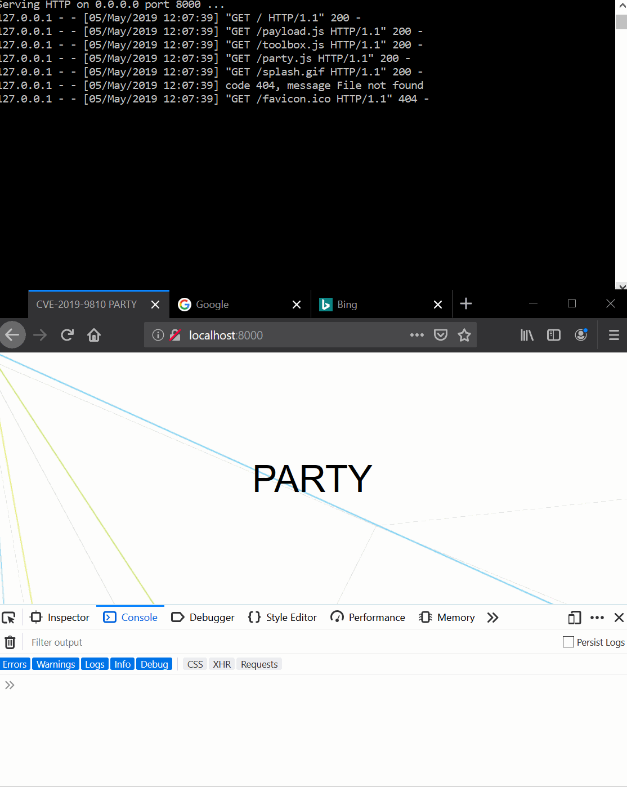

# CVE-2019-9810 Exploit for Firefox on Windows

CVE-2019-9810 is a vulnerability that has been found and exploited at [Pwn2Own 2019](https://www.thezdi.com/blog/2019/4/18/the-story-of-two-winning-pwn2own-jit-vulnerabilities-in-mozilla-firefox) by [Richard Zhu and Amat Cama](https://twitter.com/Fluoroacetate). It affects Mozilla's JavaScript engine, Spidermonkey and was used to achieve renderer compromise.

The issue has been fixed in [mfsa2019-09](https://www.mozilla.org/en-US/security/advisories/mfsa2019-09/) about two months ago.



## Overview of the issue

TODO.

## Organization

The repository contains the [exploit]() code as well as a bunch of [tools](https://github.com/0vercl0k/blazefox/blob/master/exploits/moarutils.js) that I had previously developed for my [blazefox](https://github.com/0vercl0k/blazefox) exploits. I have just brushed them up and made them work with [BigInt](https://developer.mozilla.org/en-US/docs/Web/JavaScript/Reference/Global_Objects/BigInt). As a result, the exploit assumes that the support for [BigInt](https://developer.mozilla.org/en-US/docs/Web/JavaScript/Reference/Global_Objects/BigInt) is turned on in Firefox which you can do by toggling `javascript.options.bigint` in `about:config`.


The exploit has been tested against Windows RS5 64-bit and it targets a custom build of Firefox so don't be surprised if a bit of work is required to make it work elsewhere :).

The exploitation process works very similarly than in my previous [kaizen.js](https://github.com/0vercl0k/blazefox/blob/master/exploits/kaizen.js) exploit as mentioned above. It dispatches execution on the [ReflectiveLoader](https://github.com/stephenfewer/ReflectiveDLLInjection/blob/master/dll/src/ReflectiveLoader.c#L51) of a [reflective dll](https://github.com/stephenfewer/ReflectiveDLLInjection) that implements the payload:

1. If the payload detects that it is invoked by `js.exe`, it simply spams `stdout` with `PWN`, spawns a calculator and exits.
2. If it is run from the browser, it starts by injecting itself into other `Firefox.exe` process. The way it achieves that is the exploit code passes a pointer to the reflective dll copy, and the reflective dll maps it in the other processes. Once this is accomplished, it creates a remote thread on the reflective loader and takes a nap.
3. When the payload gets executed from the other `Firefox.exe`, it first recognizes that and inline hooks the [xul!nsJSUtils::ExecutionContext::Compile](http://ff-woboq.s3-website-us-west-2.amazonaws.com/Firefox/dom/base/nsJSUtils.cpp.html#_ZN9nsJSUtils16ExecutionContext7CompileERN2JS14CompileOptionsERNS1_10SourceTextIDsEE) function. This function gets executed when scripts need to be evaluated by the JavaScript engine; so this sounded like a good candidate for what I wanted to do. The hooked version simply prepends an arbitrary JavaScript payload of our choice.
4. When the hook is placed, it simply returns. At this point, the other origins have had arbitrary JavaScript injected in them. The payload I use is simply to change the background image of those origins by the [Diary of a reverse-engineer](https://doar-e.github.io/) theme picture, as well as redirecting every links to the blog :).

In reality, there are a bunch of more subtle details that are not described by the above and so if you are interested you are invited to go find the truth and read the sources :).

## Building the payload

To build the payload, you just have to run `nmake` from a VS 2017 x64 prompt.

```text
CVE-2019-9810\payload>nmake

Microsoft (R) Program Maintenance Utility Version 14.16.27027.1
Copyright (C) Microsoft Corporation.  All rights reserved.

        ml64 /c src\trampoline.asm
Microsoft (R) Macro Assembler (x64) Version 14.16.27027.1
Copyright (C) Microsoft Corporation.  All rights reserved.

 Assembling: src\trampoline.asm
        if not exist .\bin mkdir bin
        type injected-script.js > src\injected-script.h
        cl /O1 /nologo /W3 /D_AMD64_ /DWIN_X64 /DREFLECTIVEDLLINJECTION_CUSTOM_DLLMAIN /Febin\payload.dll src\ReflectiveLoader.c src\ReflectiveDll.cc trampoline.obj /link /DLL /nologo /debug:full /PDBALTPATH:%_PDB%
ReflectiveLoader.c
Generating Code...
Compiling...
ReflectiveDll.cc
Generating Code...
   Creating library bin\payload.lib and object bin\payload.exp
        python jsify_payload.py bin\payload.dll
        move payload.js ..
        1 file(s) moved.
        del *.obj
        del src\injected-script.h
        if exist .\bin del bin\*.exp bin\*.ilk bin\*.lib
```

This creates a `payload.dll` / `payload.pdb` file inside the `payload\bin` directory. As well as a JavaScript file called `payload.js` which embeds the dll inside an [Uint8Array](https://developer.mozilla.org/en-US/docs/Web/JavaScript/Reference/Global_Objects/Uint8Array) with the offset to the loader.
